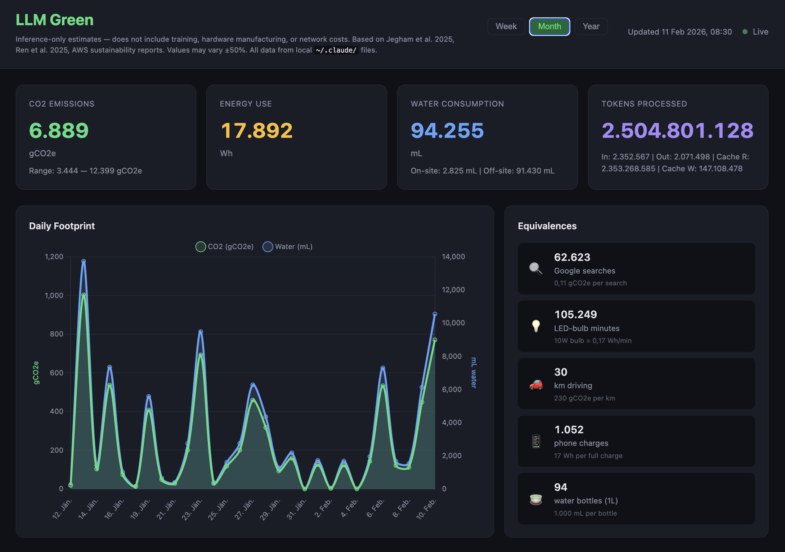

# LLM Green

**Inference-only CO2, water, and energy footprint dashboard for Claude Code.**

This is a demo/proof-of-concept. The coefficients and formulas used are best-effort estimates derived from academic research papers and provider sustainability reports. They are not verified by Anthropic. Feel free to challenge every assumption, swap out coefficients, or take the code in a different direction entirely.


---

## What It Does

Reads your local Claude Code usage data (`~/.claude/stats-cache.json` and JSONL session files) and calculates:

- **CO2 emissions** (gCO2e) from inference energy
- **Water consumption** (mL) — on-site cooling + off-site power generation
- **Energy use** (Wh) per model, per day
- **Equivalences** — Google searches, LED-bulb minutes, km driving, phone charges, water bottles

All data stays local. Nothing is sent anywhere.

## What It Does NOT Include

This dashboard only estimates **inference costs** — the electricity consumed when your queries run on Anthropic's servers. It does not account for:

- **Model training** — Training a frontier LLM can emit hundreds of tons of CO2. This cost is real but hard to amortize per query (depends on total queries served across all users over the model's lifetime, which is not published).
- **Hardware manufacturing** — Embodied carbon of GPUs, servers, networking equipment.
- **Data center construction** — Building materials, land use.
- **Network transmission** — Energy to move data between you and the data center.
- **End-user device energy** — Your computer running the CLI.

These lifecycle costs are significant but currently impossible to attribute per-query with any accuracy.

## Screenshot



## Quick Start

```bash
git clone https://github.com/romanmesicek/llm-green.git
cd llm-green
npm install
npm start
# → http://localhost:3456
```

Requires Node.js 18+ and an existing `~/.claude/` directory (created by Claude Code).

## Architecture

```
Browser (localhost:3456)
│
│  fetch /api/*  +  SSE /api/stream
│
├── public/           Vanilla HTML/JS/CSS dashboard
│   ├── index.html    Single-page layout
│   ├── style.css     Dark theme
│   ├── app.js        Fetch, render, SSE, settings
│   └── charts.js     Chart.js timeline (dual y-axis)
│
└── src/              Node.js backend (Express)
    ├── coefficients.js   All emission factors + model energy lookup
    ├── parser.js         Reads ~/.claude/stats-cache.json + JSONL files
    ├── calculator.js     Energy → CO2 → Water formulas
    └── routes.js         REST API + SSE endpoints
```

## Data Sources

### Primary: `~/.claude/stats-cache.json`

Claude Code maintains this file with cumulative usage:

- `modelUsage` — per-model token counts (input, output, cache_read, cache_creation)
- `dailyModelTokens` — output tokens per model per day
- `dailyActivity` — session and message counts per day

This is fast to read and powers the Week/Month/Year views.

### Secondary: `~/.claude/projects/**/*.jsonl`

Per-request granular data with timestamps. Used for the (currently commented-out) hourly Day view. Each assistant message contains:

```json
{
  "type": "assistant",
  "message": {
    "model": "claude-opus-4-6",
    "usage": {
      "input_tokens": 1234,
      "output_tokens": 567,
      "cache_read_input_tokens": 89012,
      "cache_creation_input_tokens": 3456
    }
  },
  "timestamp": "2026-02-10T14:23:45.123Z"
}
```

Messages are deduplicated by `message.id + requestId + uuid`.

## API Endpoints

| Endpoint | Method | Description |
|----------|--------|-------------|
| `/api/summary` | GET | All-time totals with uncertainty ranges, per-model breakdown |
| `/api/daily?days=N` | GET | Daily breakdown for last N days |
| `/api/hourly` | GET | Last 24h by hour (parses JSONL, slower) |
| `/api/models` | GET | Per-model footprint breakdown |
| `/api/config` | GET | Current coefficients |
| `/api/config` | POST | Override coefficients (persisted to `config.json`) |
| `/api/stream` | GET | SSE — pushes updates when `stats-cache.json` changes |

## Coefficients and Assumptions

This is where you should be most skeptical. Every number below is an estimate.

### Energy per 1.000 Tokens (Wh)

| Model | Wh/1k input | Wh/1k output | Source |
|-------|------------|-------------|--------|
| claude-opus-4-6, claude-opus-4-5 | 0,03 | 0,30 | Scaled from Sonnet (~3x for larger model) |
| claude-sonnet-4-5, claude-sonnet-4, claude-3-7-sonnet, claude-3-5-sonnet | 0,01 | 0,10 | Derived from Ren et al. 2025: Claude 3.7 Sonnet ≈ 0,84 Wh per short query |
| claude-haiku, claude-3-5-haiku | 0,003 | 0,03 | Scaled down (smaller model) |
| Unknown models | 0,01 | 0,10 | Falls back to Sonnet-class |

**Challenge this:** These are extrapolations. No provider publishes per-token energy. The Sonnet figure is derived from a single benchmark (Ren et al. 2025). The Opus/Haiku figures are rough scaling assumptions. Real values could be 2-5x different.

### Infrastructure Factors

| Factor | Default | Source | What to challenge |
|--------|---------|--------|-------------------|
| PUE | 1,14 | AWS sustainability reports (Ren et al. 2025) | Specific to AWS. Google claims 1,10. Older facilities: 1,4-1,6. |
| Grid CO2 intensity | 385 gCO2/kWh | US weighted average (Ren et al. 2025) | Varies enormously by region. France: ~60. Norway: ~20. India: ~700. If Anthropic's data centers use renewable PPAs, effective grid CO2 could be much lower. |
| WUE on-site | 0,18 L/kWh | AWS 2024 sustainability report | Direct cooling water at the data center. Only ~3% of total water. Varies with climate and cooling technology. |
| WUE off-site | 5,11 L/kWh | Jegham et al. 2025 | Water consumed by power plants generating electricity. Dominates ~97% of total water. Highly dependent on power mix — renewables use almost no water. |
| Cache read energy factor | 0,15 (15%) | **No published research** | How much energy a cached token costs vs. a freshly computed one. Cache reads are memory lookups, not full GPU inference. Could realistically be 0,01-0,10. **This is the most impactful setting** because cache tokens are ~94% of all tokens in typical Claude Code usage. |

### Formulas

**Energy:**
```
IT_energy = (input_tokens/1000 × Wh_per_1k_input)
          + (output_tokens/1000 × Wh_per_1k_output)
          + (cache_read_tokens/1000 × Wh_per_1k_input × cache_factor)
          + (cache_creation_tokens/1000 × Wh_per_1k_input × 1.0)

total_energy = IT_energy × PUE
```

**CO2:**
```
co2_g = total_energy_wh × grid_CO2_gPerKwh / 1000
```

**Water (two components):**
```
on-site:  IT_energy_kWh × WUE_onsite × 1000  → mL
off-site: total_energy_kWh × WUE_offsite × 1000  → mL
total:    on-site + off-site
```

On-site water uses IT energy (before PUE) because WUE measures water per unit of IT load. Off-site water uses total energy (after PUE) because the grid sees the full power draw including cooling overhead.

**Uncertainty:** All values displayed with ±50% range (low: 0,5x, high: 1,8x for CO2).

### Equivalences

| Equivalence | Factor | Source |
|-------------|--------|--------|
| Google searches | 0,11 gCO2e per search | Widely cited estimate |
| LED-bulb minutes | 0,17 Wh per minute | 10W LED bulb |
| km driving | 230 gCO2e per km | Average gasoline car |
| Phone charges | 17 Wh per charge | Average smartphone battery |
| Water bottles | 1.000 mL per bottle | 1L standard bottle |

## Settings

All coefficients are adjustable via sliders in the dashboard UI. Changes are persisted to `config.json` and take effect immediately. The sliders include detailed descriptions explaining what each parameter means and how to reason about it.

## Live Updates

The dashboard uses Server-Sent Events (SSE) to push updates when `~/.claude/stats-cache.json` changes. When you run Claude Code in another terminal, the dashboard updates automatically.

## Known Limitations and Open Questions

1. **Cache token energy is the biggest unknown.** With ~94% of tokens being cache reads, the cache energy factor dominates all calculations. No research exists on this. The default 0,15 is a conservative upper bound — the real value is likely lower (0,01-0,10), which would reduce all figures by 50-90%.

2. **Daily token estimation is approximate.** The `stats-cache.json` only stores output tokens per day per model. Input and cache tokens are estimated using cumulative ratios from all-time model usage. This assumes the ratio is stable across days, which may not be true.

3. **Model energy figures are extrapolations.** Only Claude 3.7 Sonnet has a published benchmark (Ren et al. 2025). Opus and Haiku figures are rough 3x/0,3x scaling assumptions.

4. **Grid CO2 intensity is a single US average.** Anthropic likely runs across multiple AWS regions with different power mixes. Some may have renewable energy PPAs that significantly reduce effective grid CO2.

5. **Off-site water is an upstream cost.** The dominant water footprint (~97%) comes from power plants, not the data center. You could argue this belongs to the energy grid, not the AI system. The dashboard includes it because the research literature does, but reasonable people disagree.

6. **No accounting for batching or shared infrastructure.** Multiple users share the same GPUs. The energy-per-token model assumes dedicated resources, which overstates per-user impact.

## Contributing

This is a demo. Take it, break it, improve it.

Ideas for future development:

- **Better energy coefficients** — If Anthropic or independent researchers publish per-token energy data, replace the model energy table in `coefficients.js`.
- **Regional grid intensity** — Allow selecting AWS region or country for more accurate grid CO2.
- **Training cost amortization** — If training compute and total query volume become known, add a per-query training overhead.
- **Multi-provider support** — The calculator is model-agnostic. Add parsers for OpenAI, Google, etc.
- **Data export** — CSV/JSON export for external analysis.
- **Historical trends** — Longer-term trend analysis, weekly/monthly reports.

## License

MIT

## Disclaimer

This tool provides rough estimates for educational and awareness purposes. It is not affiliated with Anthropic. The coefficients are derived from publicly available research and may not reflect actual infrastructure used by Anthropic. All calculations happen locally — no data leaves your machine.
